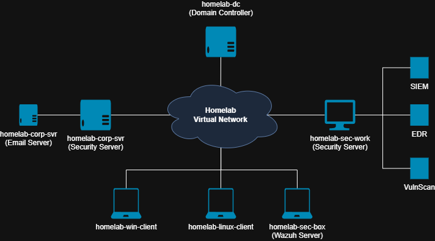
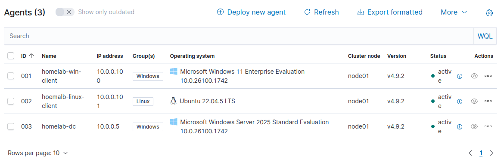
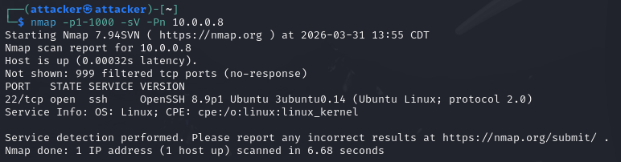
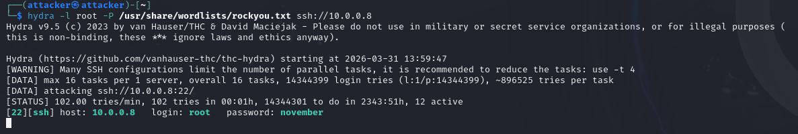
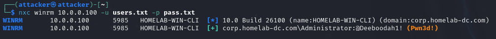
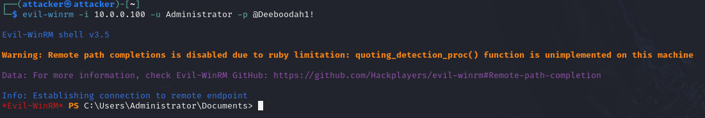
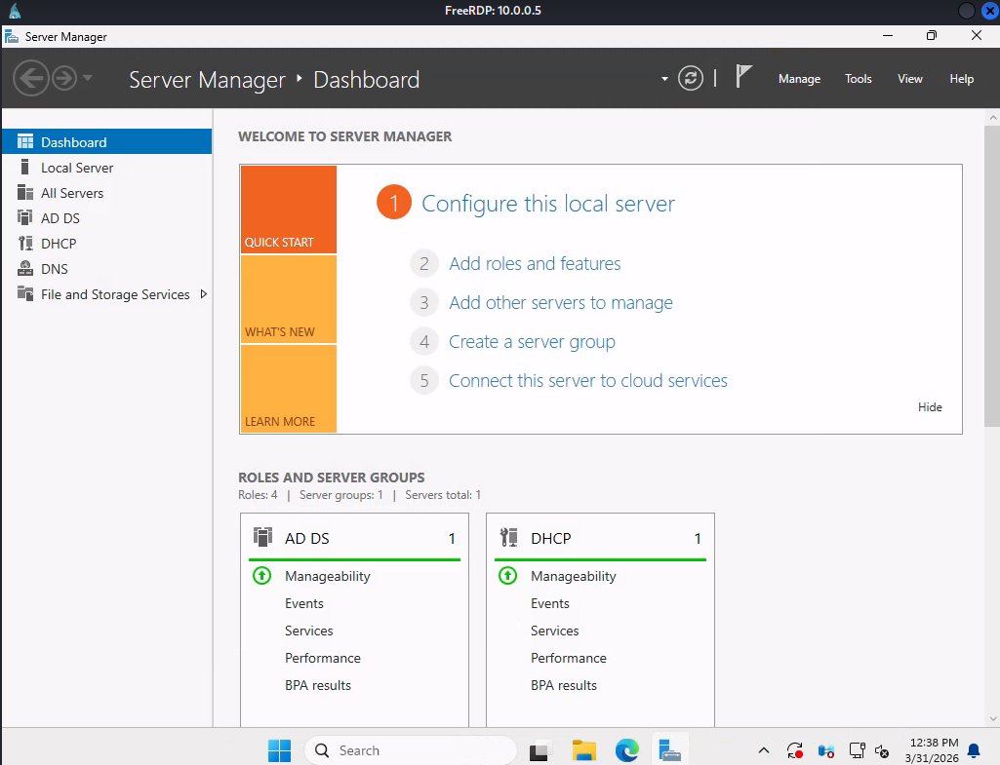
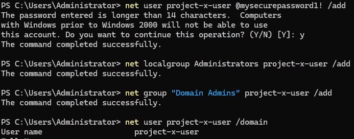
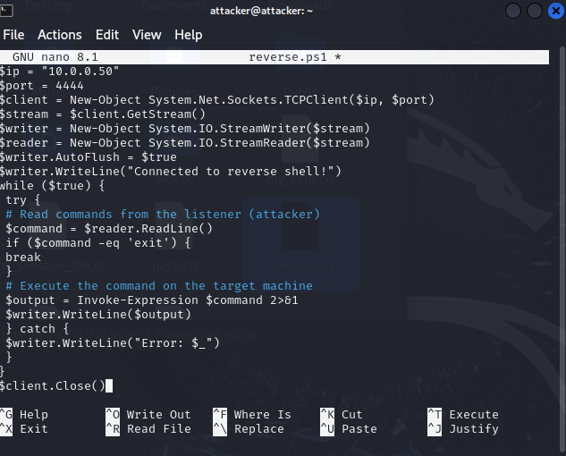

# Cybersecurity Homelab – Wazuh SIEM Detection Lab

## 1. Overview

This project is a cybersecurity homelab built using VirtualBox to simulate a small corporate network environment. The lab includes multiple Windows and Linux systems connected within an isolated network and monitored using the Wazuh SIEM platform.

The primary goal of this project is to gain hands-on experience with:

- SIEM deployment and configuration  
- Centralized log collection  
- Security event monitoring  
- Threat detection and alert analysis  
- SOC (Security Operations Center) workflows  

This environment allows for safe testing of security scenarios and investigation of alerts in a controlled setting.

---

## 2. Lab Environment

The lab simulates a corporate infrastructure with multiple systems performing different roles:

- **homelab-dc** – Windows Server acting as Domain Controller  
- **homelab-win-client** – Windows workstation (domain joined)  
- **homelab-linux-client** – Ubuntu Linux endpoint  
- **homelab-corp-svr** – Internal corporate server  
- **homelab-sec-box** – Wazuh SIEM server  
- **homelab-sec-work** – Security workstation used for monitoring and investigation  

All machines are hosted in Oracle VirtualBox and connected through a shared internal network.

### Lab Infrastructure Screenshot

---

## 3. Network Architecture

The lab environment is designed to simulate a small enterprise network. All endpoints communicate within a VirtualBox NAT/internal network, and logs from each system are forwarded to the Wazuh SIEM server.

Each endpoint runs a **Wazuh agent**, which collects system and security logs and sends them to the central Wazuh manager for analysis.

### Network Diagram

---

## 4. Monitoring Setup

Wazuh is used as the central SIEM platform for this lab.

### Components

- Wazuh Server (Manager)
- Wazuh Agents on all endpoints
- Dashboard for visualization and alerting

### Configuration Steps

- Installed Wazuh server on `homelab-sec-box`
- Deployed Wazuh agents on all Windows and Linux machines
- Configured agents to forward logs to the Wazuh server
- Verified connectivity between agents and server

### Monitored Data

Windows systems:

- Security Event Logs  
- Authentication events  
- Process activity  

Linux systems:

- Authentication logs  
- System logs  
- Audit events  

### Wazuh Agent Status

## 5. Attack Simulation – Full Attack Chain

After building the initial lab environment and integrating Wazuh for centralized monitoring, I expanded the project by simulating a full attack chain across the environment. The purpose of this exercise was to better understand how attackers move through a network and how those actions could be observed from a defender’s perspective.

This simulation followed a realistic attack flow:

- Reconnaissance
- Initial Access
- Credential Access
- Lateral Movement
- Privilege Escalation
- Domain Compromise
- Persistence

The scenario was based on an attacker targeting a simulated organization with the goal of obtaining sensitive access and maintaining control of the environment.

**Attacker motive:** Financially motivated  
**Objective:** Gain access to systems, move laterally, and establish persistence

## 5.1 Reconnaissance

The first phase focused on identifying reachable hosts and exposed services within the lab network.

Using `nmap`, I scanned the target host and identified SSH as an exposed service on `10.0.0.8`.

### Reconnaissance Screenshot

**Observed result:**
- Host `10.0.0.8` was reachable
- Port `22/tcp` was open
- SSH was running with OpenSSH on Ubuntu Linux

This provided a likely entry point for the next stage of the attack.

## 5.2 Initial Access

After identifying SSH as an available service, I simulated a brute-force attack using Hydra against the target Linux server.

### Initial Access Screenshot

**Observed result:**
- Successful authentication against SSH
- Username discovered: `root`
- Password recovered: `november`

This resulted in initial access to the target system through SSH.

## 5.3 Credential Access via Phishing

After gaining access to the initial system, I simulated credential harvesting through a phishing workflow. A fake password verification page was hosted to collect user credentials from another system in the environment.

### Phishing Page Screenshot

**Observed result:**
- A phishing page was created to mimic a password verification prompt
- The page was designed to capture submitted usernames and passwords
- This simulated a social engineering path to obtain valid credentials from another internal user

This step demonstrates how attackers may combine technical access with social engineering to continue expanding their access.

## 5.4 Lateral Movement and Password Spraying

After obtaining additional access paths, I simulated lateral movement toward Windows systems in the environment. Password spraying was performed against WinRM to test for weak or reused credentials.

### Password Spraying Screenshot

**Observed result:**
- WinRM was reachable on `10.0.0.100`
- Valid administrative credentials were identified:
  `corp.homelab-dc.com\Administrator`
- Successful authentication was achieved through password spraying

This created a path for remote administrative access into the Windows environment.

## 5.5 Remote Access with Evil-WinRM

With valid credentials discovered, I used Evil-WinRM to establish a remote shell on the Windows host.

### Evil-WinRM Screenshot

**Observed result:**
- Successful remote PowerShell session established
- Administrative access obtained on the Windows system

This stage demonstrates how attackers can leverage legitimate remote management services once credentials are compromised.

## 5.6 Domain Access via RDP

After compromising the Windows host, I pivoted further into the environment and accessed the Domain Controller through RDP.

### RDP Access Screenshot

**Observed result:**
- Successful remote desktop access to the server at `10.0.0.5`
- Administrative control over the server environment

This represents a major escalation in attacker capability, as access to domain infrastructure can lead to full environment compromise.

## 5.7 Persistence – New Administrative User

To simulate persistence, I created a new user account and added it to high-privilege groups.

### Persistence User Screenshot

**Observed result:**
- A new user account was created
- The account was added to:
  - `Administrators`
  - `Domain Admins`

This demonstrates a common persistence technique where attackers establish alternate privileged accounts to retain access.

## 5.8 Persistence – Reverse Shell Script

A second persistence mechanism was prepared using a PowerShell reverse shell script intended to provide recurring access back to the attacker system.

### Reverse Shell Script Screenshot

**Observed result:**
- PowerShell reverse shell script created
- Script prepared for later execution through persistence mechanisms such as scheduled tasks

This shows how attackers may create redundant methods of access in case one persistence path is removed.

## 5.9 Detection Opportunities in Wazuh

Throughout this attack chain, multiple actions generated activity that could be monitored through Wazuh and supporting system logs.

Examples of notable detection opportunities include:

- Network scanning activity
- Multiple failed authentication attempts
- Successful SSH logins
- Suspicious remote management activity through WinRM
- RDP logons to high-value systems
- Creation of new privileged user accounts
- PowerShell execution
- Scheduled task creation or persistence-related activity

These events can be correlated to build a timeline of compromise and identify suspicious patterns across the environment.

## 5.10 Skills Demonstrated

This phase of the project helped me practice and better understand:

- Attack chain simulation across Linux and Windows systems
- Network reconnaissance
- Credential attacks and password spraying
- Remote administration abuse through WinRM and RDP
- Privilege escalation and domain-level access
- Persistence techniques
- Security monitoring and detection opportunities in a SIEM

## 5.11 Key Takeaways

This attack simulation expanded the homelab from a SIEM deployment project into a more complete detection and investigation environment.

It demonstrated how attackers can:

- Identify exposed services
- Gain initial access through weak credentials
- Harvest credentials through phishing
- Move laterally across systems
- Abuse administrative protocols
- Establish persistence after compromise

From a defensive perspective, it reinforced the importance of:

- Centralized logging
- Monitoring authentication events
- Detecting remote administration abuse
- Watching for privilege changes and persistence mechanisms
- Investigating activity across multiple hosts rather than in isolation